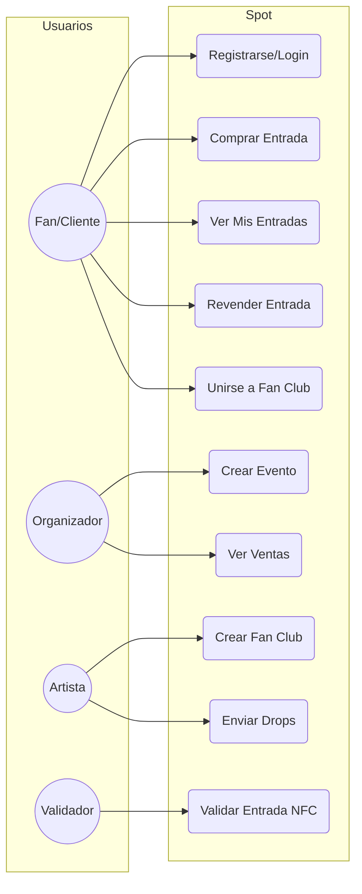
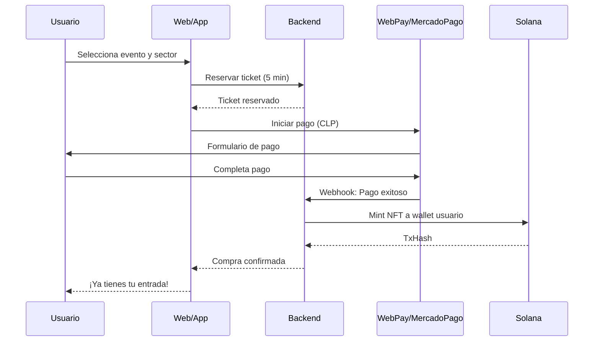
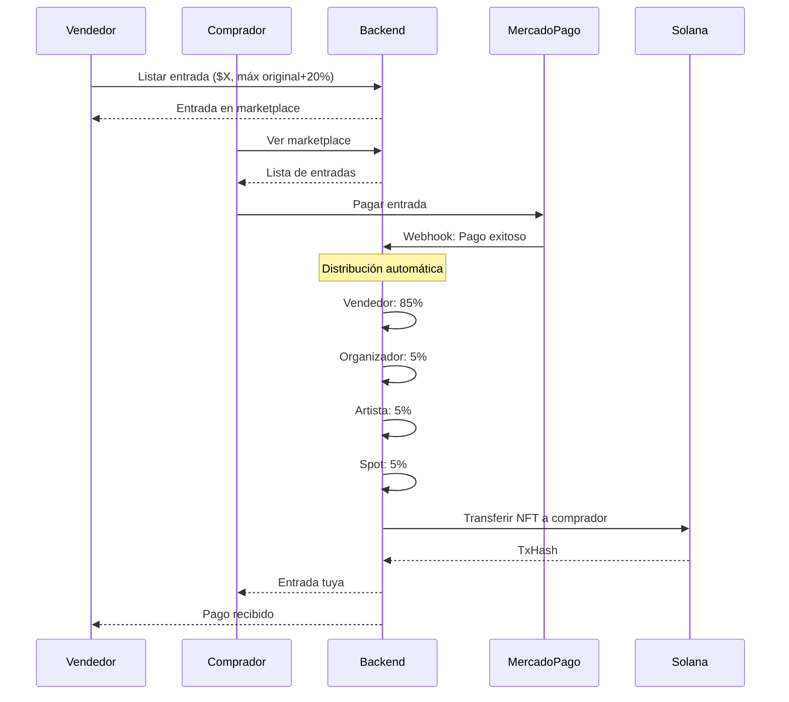
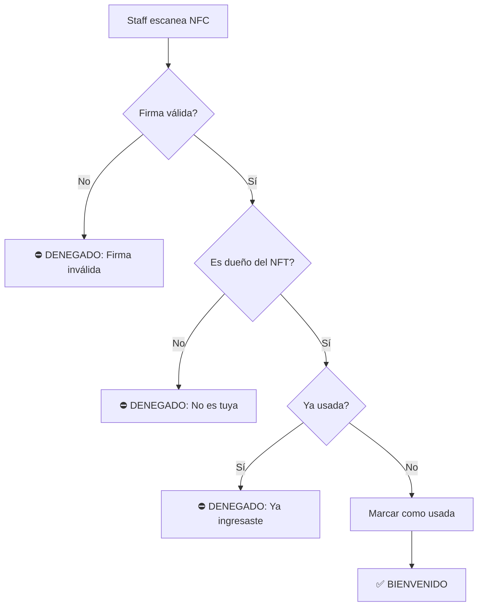
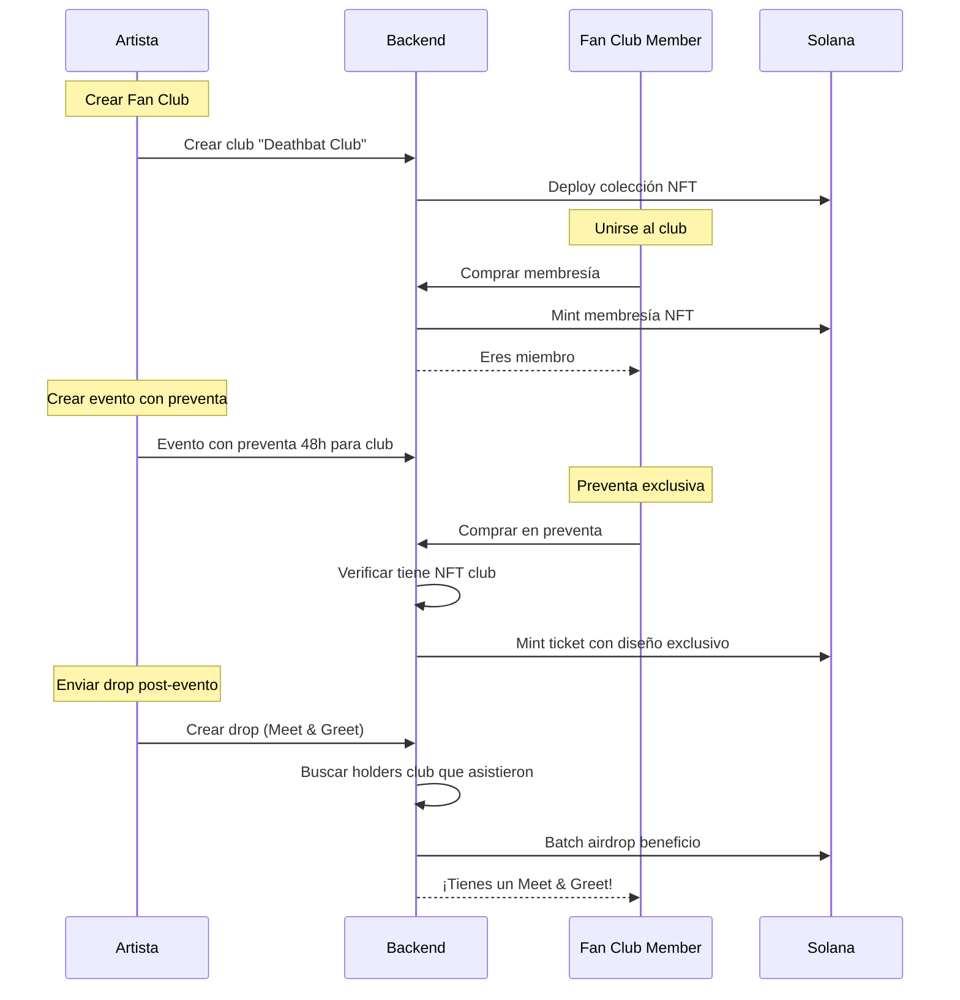
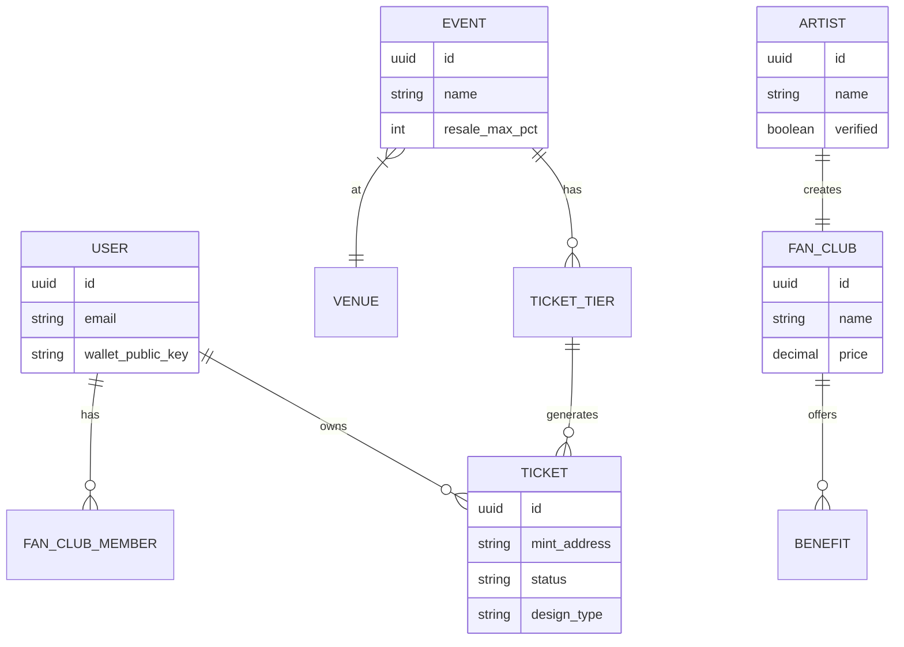

# Spot: Diagramas de Diseño

## 1. Actores del Sistema

---

## 2. Flujo de Compra (Venta Primaria)

---

## 3. Flujo de Reventa (Mercado Secundario)

---

## 4. Flujo de Validación (Ingreso NFC)

---

## 5. Fan Club: Preventa y Drops

---

## 6. Tipos de Diseño de Entrada

| Tipo | Descripción | Quién lo obtiene |
|---|---|---|
| **Estándar** | Diseño base del evento | Compra pública |
| **Fan Club** | Diseño premium exclusivo | Compra en preventa club |
| **VIP** | Diseño dorado + beneficios | Tier especial |
| **Coleccionable** | Post-evento, recuerdo digital | Todos los asistentes |

---

## 7. Modelo de Datos Simplificado

