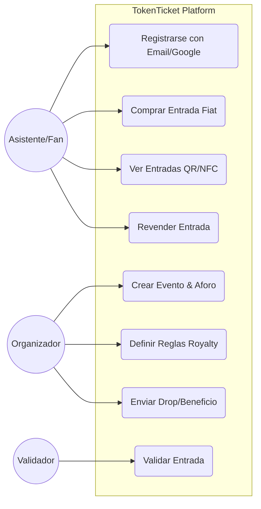
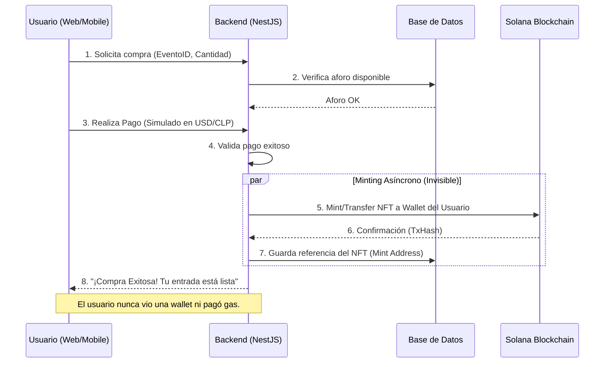
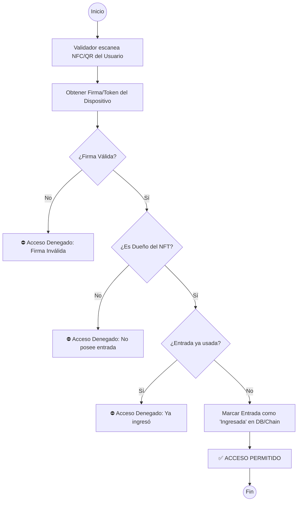
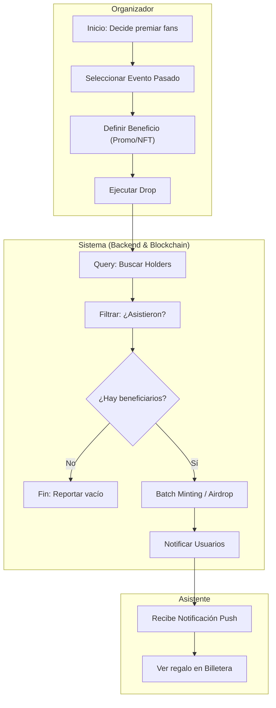

# Especificación de Diseño y Procesos: TokenTicket

## 1. Estrategia de Abstracción Web3 (Invisible Wallet)
Para cumplir con el requisito de "abstraer la complejidad", el sistema implementará un modelo de **Billeteras Custodias (Custodial Wallets)** o **Inicio de Sesión Social (Web3Auth)**.

*   **Usuario Final:** Se registra con Google/Email. No ve "frases semilla" ni firma transacciones manualmente. El backend gestiona su llave privada de forma segura (o se usa MPC - Multi-Party Computation).
*   **Transacciones:** El usuario paga con tarjeta (simulado) y el sistema "atrás" acuña/transfiere el NFT a su billetera.
*   **Gas Fees:** El organizador o la plataforma subvencionan los costos de gas (Gasless Transactions) para que la experiencia sea 100% fluida.

---

## 2. Diagramas de Casos de Uso

### Actores
*   **Asistente (Fan):** Usuario final. Quiere comprar entradas y entrar al evento sin saber de crypto.
*   **Organizador:** Crea eventos, define reglas y envía beneficios (drops).
*   **Validador (Seguridad):** Verifica las entradas en la puerta.
*   **Sistema (Backend/Blockchain):** Gestiona la lógica automática.

---

## 3. Diagramas de Procesos (BPMN)

### 3.1. Proceso de Compra de Entrada (Abstracción Web3)
Este flujo muestra cómo transformamos un pago tradicional en una transacción blockchain transparente para el usuario.

### 3.2. Proceso de Validación de Acceso (NFC/QR)
Validación segura offline-first u online rápida garantizando que el ticket es válido y no ha sido usado.

### 3.3. Ciclo de Vida del Fan Club (Drops & Fidelización)
Cómo el organizador interactúa con sus fans post-evento (Flujo BPMN en Carriles).

## 4. Actualización del Stack para Abstracción
*   **Auth:** Usaremos **Web3Auth** o una implementación propia de custodia cifrada en backend.
*   **Pagos:** Integración mock de Stripe/MercadoPago para simular el flujo "Web2".
*   **Gas:** Usaremos un "Fee Payer" (una wallet del sistema que paga todas las comisiones de los usuarios).
