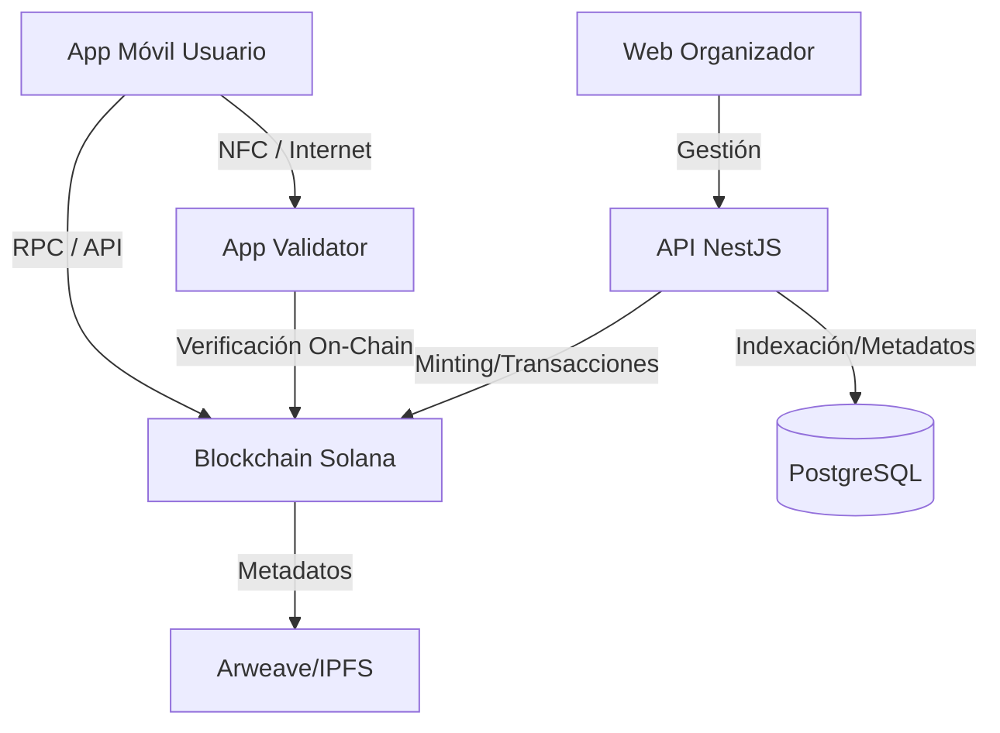

# Planificación Técnica y Arquitectura: TokenTicket

## 1. Resumen Ejecutivo
TokenTicket es un ecosistema de ticketing descentralizado que utiliza tecnología Blockchain para garantizar la propiedad, trazabilidad y control del mercado secundario de entradas. El sistema incorpora validación física mediante NFC y soporte multiplataforma (Web y Móvil).

**> [!NOTE]**
**> Ver [Especificación de Diseño y Diagramas (Casos de Uso, BPMN)](file:///C:/Users/Benja/.gemini/antigravity/brain/85929a9c-a527-46a0-a18c-38c5bdc2dee7/design_diagrams.md) para detalles visuales de los flujos.**

## 2. Tecnologías Seleccionadas (Stack Tecnológico)

Para garantizar un rendimiento de "clase mundial", escalabilidad real y bajos costos, se ha seleccionado el siguiente stack:

### 2.1. Blockchain: **Solana**
*   **Justificación:** Es la blockchain de capa 1 más rápida (65,000 TPS teóricos, ~4,000 reales) y económica (<$0.001 por transacción).
*   **Por qué no EVM (Ethereum/Polygon)?** Aunque Polygon es rápido, Solana ofrece una latencia final mucho menor ("sub-second finality"), lo cual es crítico para la validación en puerta (NFC) donde cada milisegundo cuenta para el flujo de personas.
*   **Estándar de Token:** Metaplex (Estándar de NFTs en Solana) con "Programmable NFTs" (pNFTs) para forzar regalías y reglas de transferencia a nivel de protocolo.

### 2.2. Backend & API: **NestJS (Node.js)**
*   **Justificación:** Framework progresivo de Node.js, altamente escalable y modular.
*   **Arquitectura:** Microservicios o Monolito Modular.
*   **Base de Datos:**
    *   **PostgreSQL:** Para datos relacionales off-chain (perfiles de usuario, configuración de eventos, analíticas).
    *   **Redis:** Para caché de alto rendimiento y sesiones.
*   **Cola de Mensajes:** BullMQ (Redis based) para manejar picos de minting masivo sin bloquear el servidor.

### 2.3. Frontend (Web Organizadores & Marketplace): **Next.js (React)**
*   **Justificación:** Renderizado híbrido (SSR/CSR) para SEO y velocidad. Excelente integración con wallets de Solana (Wallet Adapter).
*   **Estilo:** Tailwind CSS + ShadcnUI para una interfaz moderna y premium.

### 2.4. Aplicaciones Móviles (Usuario & Validador): **React Native (Expo)**
*   **Justificación:** Permite usar una base de código única para iOS y Android con rendimiento nativo.
*   **NFC:** Librería `react-native-nfc-manager` para comunicación bidireccional entre el móvil del usuario y el del validador.

### 2.5. Almacenamiento Descentralizado: **IPFS (via Pinata o Arweave)**
*   **Uso:** Almacenar imágenes y metadatos de los tickets para que sean inmutables y no dependan de un servidor central.

## 3. Arquitectura del Sistema

### Flujo de Validación NFC (Offline/Online Híbrido)
1.  **Usuario:** Abre su entrada en la App. La App genera un "Zero-Knowledge Proof" o firma un mensaje temporal con su llave privada (dueña del NFT).
2.  **Transmisión:** El usuario acerca el celular al lector (App Validador) via NFC.
3.  **Validador:** Recibe la firma y consulta a la Blockchain (o a un índice local actualizado) si esa llave pública posee el NFT válido para el evento.
4.  **Confirmación:** < 2 segundos.

## 4. Estrategia de Escalabilidad
*   **Blockchain:** Solana maneja nativamente la escala de transacciones. Para "drops" masivos, se utiliza el "Candy Machine" de Metaplex que gestiona la concurrencia.
*   **Backend:** Despliegue en contenedores (Docker/Kubernetes). Balanceadores de carga de AWS/GCP para distribuir el tráfico HTTP.
*   **Optimización:** Indexadores propios (o servicios como Helius) para leer el estado de la blockchain rápidamente sin saturar los nodos RPC.

## 5. Plan de Implementación (Roadmap)

### Fase 1: Core Blockchain & Smart Contracts (Semana 1-4)
*   Desarrollo de Programas en Solana (Rust/Anchor).
*   Definición de reglas de Royalty y Transferencia restringida.
*   Tests unitarios en red local.

### Fase 2: Backend & Infraestructura (Semana 3-6)
*   Setup de NestJS + PostgreSQL.
*   API de creación de eventos y subida de metadatos a IPFS.
*   Integración con Solana (Minting API).

### Fase 3: Web App de Organizador (Semana 5-8)
*   Dashboard para crear eventos (Formularios, Imágenes).
*   Dashboard de ventas y analíticas en tiempo real.

### Fase 4: App Móvil Usuario (Wallet) (Semana 7-10)
*   Creación de Wallet in-app (Custodial o Non-custodial con "Web3Auth" para login social).
*   Visualización de Tickets (NFTs).
*   Implementación de NFC para emitir prueba de propiedad.

### Fase 5: App Móvil Validador & Acreditación (Semana 9-11)
*   Lectura NFC.
*   Lógica de verificación contra la Blockchain.
*   Sistema de acreditación (badges para staff/VIP).

### Fase 6: QA, Auditoría y Despliegue (Semana 12)
*   Auditoría de seguridad de Smart Contracts.
*   Pruebas de carga (Load Testing).
*   Despliegue en Mainnet Beta de Solana.

## 6. Siguientes Pasos (Aprobación de Usuario)
*   Confirmar si se prefiere **Solana** (recomendado para performance) o se insiste en EVM (Polygon/Base - más compatible pero potencialmente más lento/caro en picos, aunque muy capaz).
*   Validar el alcance de la **App de Acreditación** (¿separada o rol dentro de la App Validador?). *Suposición: App separada o módulo específico.*

